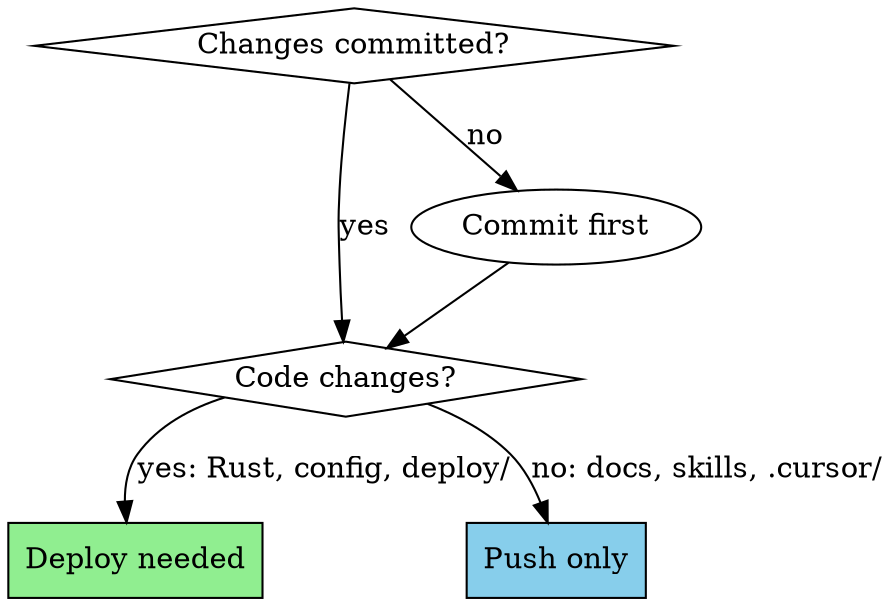

# Evaluator Deploy

Commit, push, and deploy the trader_evaluator project to the shared EC2 t3.micro.

## Pre-flight (local)

All three must pass. Run via Makefile which also checks skills sync:

```bash
make test
```

This runs: `cargo test --all` + `cargo clippy --all-targets -- -D warnings` + `cargo fmt --check`

If any fail, fix before proceeding. Never commit with failures.

## Commit and push

```bash
git add <specific-files>
git commit -m "feat/fix/chore: description"
git push origin main
```

**Rules:**
- Commit BEFORE deploying so deployed binary matches repo state
- Never commit `.env`, `data/`, or credentials
- Use conventional commit messages (`feat:`, `fix:`, `chore:`, `docs:`, `test:`)

## Deploy

```bash
make deploy SERVER=ubuntu@3.8.206.244
```

This Makefile target:
1. Runs `make test` (pre-flight)
2. Cross-compiles with `cargo build --release --target x86_64-unknown-linux-musl`
3. SCPs binary + config to `/opt/evaluator/` on server
4. Restarts `evaluator` systemd service
5. Waits 10s then runs `make check`

**Do NOT** run `cargo build --release` locally for deploy — that builds macOS binaries.

**When to deploy:** Only when code changes need to go live on the server. Config-only changes, docs, cursor rules, skills — these don't need deploy.

## Post-deploy verification

### 1. Service running

```bash
ssh -i trading-bot.pem ubuntu@3.8.206.244 
  'systemctl is-active evaluator && systemctl status evaluator --no-pager -l'
```

Should print `active`.

### 2. Metrics endpoint responding

```bash
ssh -i trading-bot.pem ubuntu@3.8.206.244 
  'curl -s localhost:9094/metrics | head -5'
```

Port 9094 is the evaluator (trading uses 9090-9093).

### 3. No crash loops

```bash
ssh -i trading-bot.pem ubuntu@3.8.206.244 
  'journalctl -u evaluator --no-pager -n 20'
```

Check for panic traces, repeated restarts, or connection errors.

### 4. Phase checks (run the appropriate phase for current progress)

```bash
make check-phase-0 SERVER=ubuntu@3.8.206.244   # Foundation: tables exist
make check-phase-1 SERVER=ubuntu@3.8.206.244   # Market discovery working
make check-phase-2 SERVER=ubuntu@3.8.206.244   # Wallets discovered + classified
make check-phase-3 SERVER=ubuntu@3.8.206.244   # Ingestion running, no gaps
make check-phase-4 SERVER=ubuntu@3.8.206.244   # Paper trading active
make check-phase-5 SERVER=ubuntu@3.8.206.244   # Wallet scores computed
```

Run the highest phase the system has reached. Each phase check includes all prior phases.

### 5. Pipeline status (human-friendly overview)

```bash
make status SERVER=ubuntu@3.8.206.244
```

Shows counts at every pipeline stage: markets, wallets, trades, paper trades, scores.

## Decision: deploy or not?



## Quick reference

| Step | Command | Pass criteria |
|------|---------|---------------|
| Test | `make test` | 0 failures, 0 warnings, formatted |
| Commit | `git commit && git push` | Clean working tree |
| Deploy | `make deploy SERVER=ubuntu@3.8.206.244` | No errors |
| Service | `systemctl is-active evaluator` | `active` |
| Metrics | `curl localhost:9094/metrics` | Non-empty |
| Logs | `journalctl -u evaluator -n 20` | No panics |
| Phase check | `make check-phase-N` | All assertions pass |
| Status | `make status` | Counts look reasonable |

## Common failures

| Symptom | Cause | Fix |
|---------|-------|-----|
| `cross` not found | Not installed | `cargo install cross` |
| musl build fails | Missing target | `rustup target add x86_64-unknown-linux-musl` |
| Service fails immediately | Bad config or missing dirs | `journalctl -u evaluator -n 30` |
| `connection refused` on 9094 | Service crashed or wrong port | Check systemd status + config |
| SQLite locked | Concurrent writers | Only one evaluator instance should run |
| Phase check fails | Pipeline hasn't reached that phase | Run lower phase check |
| `make test` fails on skills-sync | Skills out of sync | Run `./scripts/check_skills_sync.sh` |
