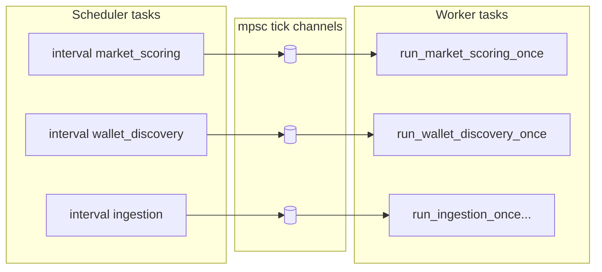

# Trader Evaluator — Runtime & Orchestration Architecture

This document describes how the **evaluator process** is wired: scheduling, job execution, and data flow. It covers the current design and a target single-process evolution (event-driven, work queues, observability, saga). The web crate and deployment are out of scope except where they share the same binary or observability.

**Audience:** Contributors and anyone implementing the target design.

---

## 1. Current architecture

### Runtime

- **Single Tokio runtime** in `crates/evaluator` (`#[tokio::main]` in `main.rs`).
- The web dashboard is a **separate binary** (`crates/web`); it does not share the evaluator’s scheduler or state.

### Orchestration

The evaluator uses a **timer-driven “tick” pattern**:

- **Scheduler** (`crates/evaluator/src/scheduler.rs`): `start()` spawns one task per job. Each task runs `tokio::time::interval_at(interval)` and, on every tick, sends `()` on an `mpsc::channel::<()>(8)`.
- **Workers** (`main.rs`): One worker task per job type. Each does `while rx.recv().await.is_some() { run_*_once(...) }`. There is no payload—only a “go” signal. If a worker is slow, ticks can be dropped (channel capacity 8); there is no durable queue.

### Data flow

- **Bootstrap:** On startup, `main` runs `run_market_scoring_once` and `run_wallet_discovery_once` once, then starts the scheduler.
- **Ongoing:** All jobs run on **fixed intervals** (configurable in `config/default.toml`). Dependencies are **implicit**: e.g. paper_tick reads from DB after trades_ingestion has written; there is no “on event X, run Y.” No typed events or subscriptions.

### Failure handling

- On job failure: log with `tracing::error!` and continue. No compensation, no saga, no retry queue.

### Observability

- **Logging:** `tracing::info!` / `error!` with JSON to stdout (Grafana Loki). No span hierarchy or trace IDs.
- **Metrics:** Prometheus on port 9094 (see `crates/evaluator/src/metrics.rs`).
- **Traces:** None. Grafana Tempo and service graph cannot be populated without adding trace instrumentation.

### Current flow (conceptual)

---

## 2. Target architecture (single process)

The following is the **intended direction** for the evaluator, still as a **single process** (one deployable binary). No implementation is implied in this document.

### Async tasks and work queue (Akka-like)

- Move from “one tick, one run” to a **work queue**: jobs receive units of work (e.g. “score these market IDs,” “ingest this wallet”) with optional backpressure.
- Multiple worker tasks can drain the same queue (worker pool). Implementation stays in-process (e.g. `mpsc` or a bounded channel of typed messages).

### Event-driven

- Emit **typed in-process events** (e.g. `MarketsScored`, `WalletsDiscovered`, `TradesIngested`) and have subscribers trigger downstream work or enqueue tasks.
- Single process: events are delivered via channels or a small in-process bus, not an external broker.

### Tokio

- **Tokio remains** the async runtime. All I/O and task scheduling stay on it; no additional runtime.

### Observability (Grafana Tempo and service graph)

- **Tempo:** Instrumentation should emit **traces** (e.g. OpenTelemetry or `tracing` spans with trace IDs) so that job runs and key steps (market scoring, wallet discovery, paper tick, etc.) appear as spans. That allows Grafana Tempo to show latency and flow.
- **Service graph:** Define logical “services” (e.g. market_scoring, wallet_discovery, ingestion, paper_trading) and document that the service graph view will be built from these trace spans. In-process today; the same concepts apply if the system is split into multiple processes later.

### Saga (local)

- For multi-step flows that need rollback (e.g. “reserve paper trade → execute → on failure compensate”), use a **local saga** pattern: state in DB, compensating actions in code, all in one process. No distributed saga in this phase.

### Target flow (conceptual)

---

## 3. Paper trading: where it runs

### Current and target (this document)

Paper trading stays in the **same evaluator process**. Today: `run_paper_tick_once` is one of the tick-driven workers in `main.rs`; it reads from DB (`trades_raw`, `paper_trades`, risk state) and writes `paper_trades` / `paper_positions`. In the target design it remains a consumer of the in-process event/queue flow (e.g. reacts to `TradesIngested` or a dedicated paper-tick queue).

### Why same process for now

Single deployable, no network boundary, shared DB and config. Fits t3.micro and current phase.

### Optional future split

If you later want isolation (e.g. paper engine as its own process for safety or different scaling), the same event/queue concepts can apply: the paper service subscribes to trade events via a queue or HTTP, runs mirror + risk logic, and writes to the same or a dedicated DB. That would be a later architecture iteration, not part of the single-process target in this doc.

---

## 4. Scaling

### Single process (current and target in this doc)

- **Vertical:** More wallets/markets mean more API calls, more DB rows, longer job runs. Scaling = faster CPU, more memory, and/or tuning (batch sizes, worker concurrency, intervals). Tokio handles many concurrent tasks; the bottleneck is usually SQLite write throughput and Polymarket API rate limits.
- **Limits:** One SQLite DB, one process. On a t3.micro you are bounded by disk I/O and API delays; the design does not yet target horizontal scaling.

### Scaling out (multi-process, for later)

- **When it might be needed:** Separate ingestion (high I/O) from scoring/paper (CPU); or run paper trading in a dedicated process for risk isolation; or run multiple evaluator instances with sharded wallets.
- **How the design helps:** Event-driven + work queues in this doc are **conceptually** the same as “producer/consumer with a queue.” If you later introduce a real queue (e.g. Redis, SQS) or HTTP between processes, the same “events” (MarketsScored, TradesIngested, etc.) can become messages; workers become separate deployables. The document states this as the intended evolution path so that future multi-process scaling does not require a different architecture—just replacing in-process channels with a durable or network-backed bus.

---

## 5. Migration path (high level)

Implementing the target can be done in phases, for example:

1. **Tracing:** Add `tracing` spans and trace IDs for Tempo and service graph.
2. **Events:** Introduce typed events and in-process subscribers.
3. **Queues:** Replace tick channels with work queues where beneficial.
4. **Saga:** Add local saga for the paper-trade flow (reserve → execute → compensate on failure).

No task breakdown or code changes are specified here; this is the order of concerns for a future implementation plan.

---

## 6. References

| Document / code | Purpose |
|-----------------|---------|
| `docs/REFERENCE.md` | Technical stack, DB tables, project structure |
| `docs/STRATEGY_BIBLE.md` | Domain rules, persona taxonomy, WScore/MScore |
| `crates/evaluator/src/main.rs` | Current job wiring and worker loops |
| `crates/evaluator/src/scheduler.rs` | Timer and tick channel setup |
